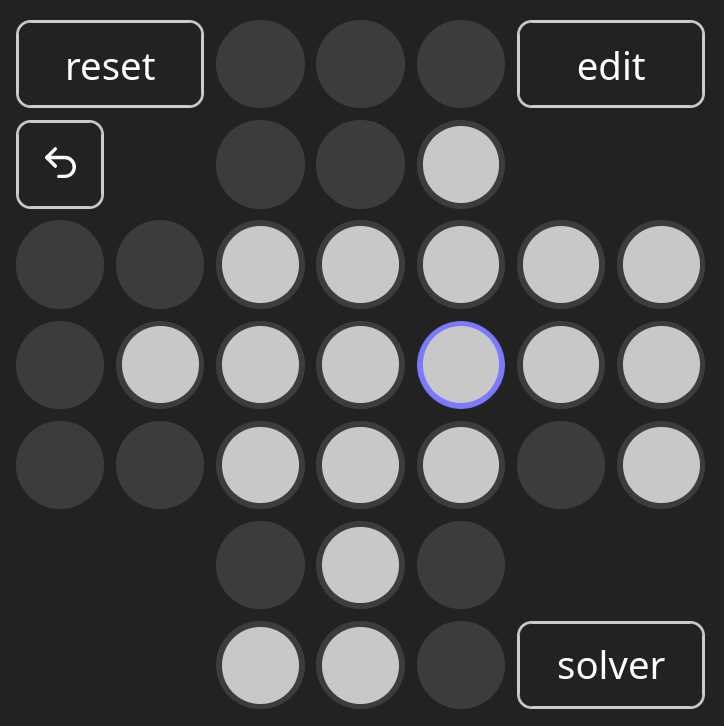

<div align="center">
  
# Peg Solitaire
**implementation of the game & an automated solver**

[projects.pascalsommer.ch/pegsolitaire](https://projects.pascalsommer.ch/pegsolitaire)



</div>

The classic single player game of Peg Solitaire, implemented in Rust for the browser.

This project implements an automated solver that is optimized for the constraints relevant
to a WASM application: low RAM and network usage.

Additionally, the techniques that were used to implement the solver are described in
a detailed report: [projects.pascalsommer.ch/pegsolitaire/precomputing-pegsolitaire-paper.pdf](https://projects.pascalsommer.ch/pegsolitaire/precomputing-pegsolitaire-paper.pdf)

## Project Structure

* `frontend` contains the Rust code for rendering the game as a web application.
* `precompute` contains Rust code for computing the bloom filters and for running performance evaluations.
* `common` is a Rust library crate containing some shared game logic code.
* `report` contains the typst source for the [paper](https://projects.pascalsommer.ch/pegsolitaire/precomputing-pegsolitaire-paper.pdf) explaining the method.
* `evaluation` contains some Jupyter notebooks to analyze the measurements and generate plots for the report.


## Architecture Overview


Project tasks such as starting up a local dev server, testing, deploying, etc. are done via the [`just` tool](https://github.com/casey/just).

Make sure to first set up the `.env` file before deploying.

```bash
cp .env.example .env
# now edit .env in your favourite editor

just dev # starts up a local dev server

just test # runs unit tests

just deploy # builds the application and uploads it to the webserver
```
